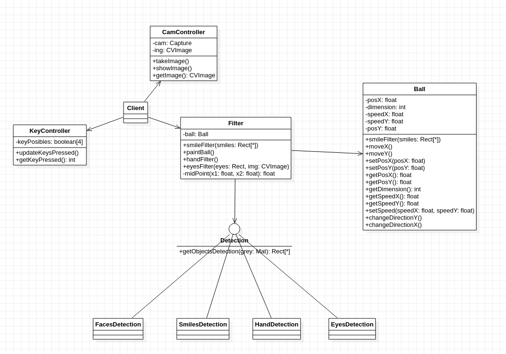

# Computer-Vision-Processing


## Autor
Miguel Ángel Medina Ramírez <br>
Correo: miguel.medina108@alu.ulpgc.es

## Índice
1. [Introducción](#introducción)
3. [Dependencias](#dependencias)
3. [Implementación](#implementación)<br>
 3.1. [Diseño de clases](#diseño-de-clases)<br>
 3.2. [Detección de caras](#detección-de-sonrisas)<br>
 3.3. [Detección de sonrisas](#detección-de-sonrisas)<br>
 3.4. [Detección de ojos](#detección-de-ojos)<br>
 3.5. [Detección de manos](#detección-de-manos)<br>
 3.5. [Detalles sobre los modelos](#detalles-sobre-los-modelos)<br>
4. [Eventos y Controles](#eventos-y-controles)
5. [Bibliografía](#bibliografía)

## Introducción
En está práctica se pretende hacer uso de la cámara para implementar alguna aplicación gráfica. Se ha escogido hacer uso de **OpenCV** y de varias técnicas de visión por computador para implementar una serie de filtros o aplicaciones que implique la detección de alguna parte del cuerpo y como respuesta alguna modificación en las imagenes sacadas con la cámara haciendo uso de **processing**.
 
## Dependencias
Para poder ejecutar y probar la práctica solamente se necesita clonar este repositorio y el editor de processing con la siguiente dependencia:
- La librería **GifAnimation** para poder reproducir y guardar gifs. Como esta librería no forma parte necesaria para la correcta implementación de la práctica, en el código toda la lógica relacionada con ella se encuentra comentada, además de que afecta al rendimiento de la aplicación.En este [enlace](https://github.com/extrapixel/gif-animation) se encuentra la forma de instalarla.
 
- La librería **CVImage** para utilizar OpenCV.
 
- La librería **GStreamer based video library for Processing** para captura la cámara.


## Implementación

### Diseño de clases
<p align="center"> 
   </img>
   <p align="center">Figura 1: Diagrama de clases</p>
</p>

### Detección de caras

El objetivo de este filtro es detectar las caras y mediante un algoritmo aleatorio que consiste en elegir otro serie de píxeles de la imagenes para sustituir la cara, con la certeza que no se pueden recomponer las imágenes de las caras.Para ello se ha implementado el siguiente código.

```java
  public void facesFilter(Rect[] faces, CVImage img){
    noFill();
    stroke(255,0,0);
    strokeWeight(4);
    if(faces.length > 0){
      for (Rect r : faces) {
        for(int x = 0; x < width; x++){
          for(int y = 0; y < height; y++){
              if(x > r.x && x < r.x + r.width && y > r.y && y < r.y + r.height){
                int loc         = x+y*width;
                int locRandom   = (int)random(0,width)+(int)random(0,height)*width;
                img.pixels[loc] = img.pixels[locRandom];
              }
          }
        }
     }
     image(img,0,0);
    }
    noFill();
    stroke(255,255,255);
    text("Faces Detector",width*0.1,height*0.05);

  }
```

<p align="center"> 
   </img>
   <p align="center">Figura 2: Detector de caras</p>
</p>

### Detección de sonrisas

La idea de este filtro es utilizar la detección de sonrisas para permitir al usuario ver las imágenes tomadas con la camara.

```java
public void smileFilter(Rect[] smiles){
    text("Simel Detector",width*0.1,height*0.05);
    noFill();
    stroke(5,234,249);
    strokeWeight(4);
    if(smiles.length == 0){
      background(0);
      text("Smile",width*0.5,height*0.5);
      return;
    }
    for (Rect r : smiles) {
      rect(r.x, r.y, r.width, r.height);
    }
  }
```

<p align="center"> 
   </img>
   <p align="center">Figura 3: Detector de sonrisas</p>
</p>

### Detección de ojos

La idea es utilizar la posición de los ojos(se utiliza el punto medio de estos) para controlar el nivel de umbralizado de la imagen.

```java
  private float midPoint(float x1,float x2){
    return (x1+x2)/2;
  }
  
  public void eyesFilter(Rect[] eyes, CVImage img){
    noFill();
    stroke(255,0,0);
    strokeWeight(4);
    CVImage auximg = new CVImage(width,height);
    if(eyes.length == 2){
      Mat grey = img.getGrey();
      Imgproc.threshold(grey,grey,255*midPoint(eyes[0].x,eyes[1].x)/width,
      255*midPoint(eyes[0].y,eyes[1].y)/height,Imgproc.THRESH_BINARY);
      cpMat2CVImage(grey,auximg);
      image(auximg,0,0);
    } 
    for (Rect r : eyes) {
      rect(r.x, r.y, r.width, r.height);
    }
    noFill();
    stroke(255,255,255);
    text("Eyes Detector",width*0.1,height*0.05);
  }
}
```

<p align="center"> 
   </img>
   <p align="center">Figura 4: Detector de Ojos</p>
</p>

### Detección de manos

Quizás este sea el más divertido, consiste en un filtro de *realidad aumentada* en donde se utiliza un detector de palmas de manos para intentar detener una pelota que gira por toda la cámara de forma aleatoria.

```java
  private void moveBall(){
    ball.moveX();
    ball.moveY();
    if (ball.getPosX() >= width || ball.getPosX() <= 0){
        ball.changeDirectionX();
    }
    if (ball.getPosY() >= height || ball.getPosY() <= 0){
        ball.changeDirectionY();
    }
  }
  
  public void handFilter(Rect[] faces){
    text("Hands Detector",width*0.1,height*0.05);
    noFill();
    stroke(255,0,0);
    strokeWeight(4);
    paintBall();
    boolean isBallIntoArea = false;
    if(faces.length > 0){
      for (Rect r : faces) {
        if(ball.posX > r.x && ball.posX < r.x + r.width && ball.posY > r.y && ball.posY < r.y + r.height){
          isBallIntoArea = true;
        }
        rect(r.x, r.y, r.width, r.height);
      }
    }
    if(!isBallIntoArea)moveBall();
    noFill();
    stroke(255,255,255);
    text("Hands Detector",width*0.1,height*0.05);
  }
```

<p align="center"> 
   </img>
   <p align="center">Figura 4: Detector de Manos</p>
</p>

### Detalles sobre los modelos

Todos los modelos usados utilizan un aproximación de **detección en cascada**. La detección de objetos usando los clasificadores en cascada basados ​​en características de Haar es un método efectivo de detección de objetos propuesto por Paul Viola y Michael Jones en su artículo, "Detección rápida de objetos usando una cascada mejorada de características simples" en 2001. Es un enfoque basado en el aprendizaje automático donde La función en cascada se forma a partir de muchas imágenes positivas y negativas. Luego se usa para detectar objetos en otras imágenes. Aunque son efectivos suelen ser **muy dependientes de la iluminación y bajo en entorno inadecuado suelen fallar** a parte que datan de hace ochos años y actualmente existen diversas técnicas más avanzadas en este ámbito pero como no es objetivo en esta práctica se ha preferido en utilizar un enfoque más sencillo.

## Eventos y Controles

<table style="width:100%">
  <tr>
    <th>Tecla</th>
    <th>Uso</th>
  </tr>
  <tr>
    <td>q</td>
    <td>Filtro de caras</td>
  </tr>
  <tr>
    <td>w</td>
    <td>Filtro para detectar sonrisas</td>
  </tr>
  <tr>
    <td>e</td>
    <td>Filtro para detectar manos</td>
  </tr>
  <tr>
    <td>r</td>
    <td>Filtro para detectar osjo</td>
  </tr>
</table>


## Bibliografía

* [Guion de prácticas](https://cv-aep.ulpgc.es/cv/ulpgctp20/pluginfile.php/126724/mod_resource/content/22/CIU_Pr_cticas.pdf)
* [processing.org](https://processing.org/)
* [OpenCV](https://docs.opencv.org/master/db/d28/tutorial_cascade_classifier.html)
* [CVImage](http://www.magicandlove.com/blog/2018/03/13/cvimage-and-pixelflow-in-processing/)